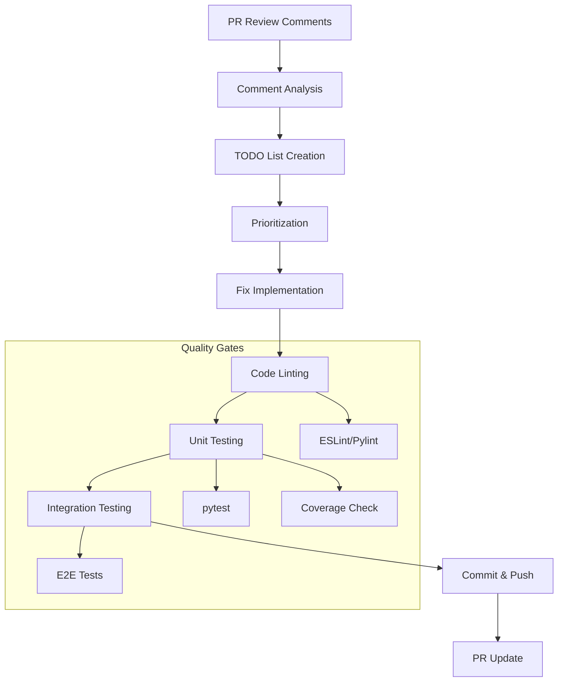
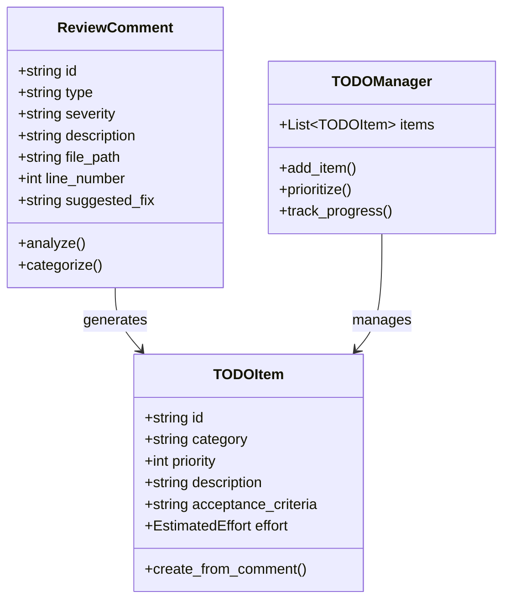
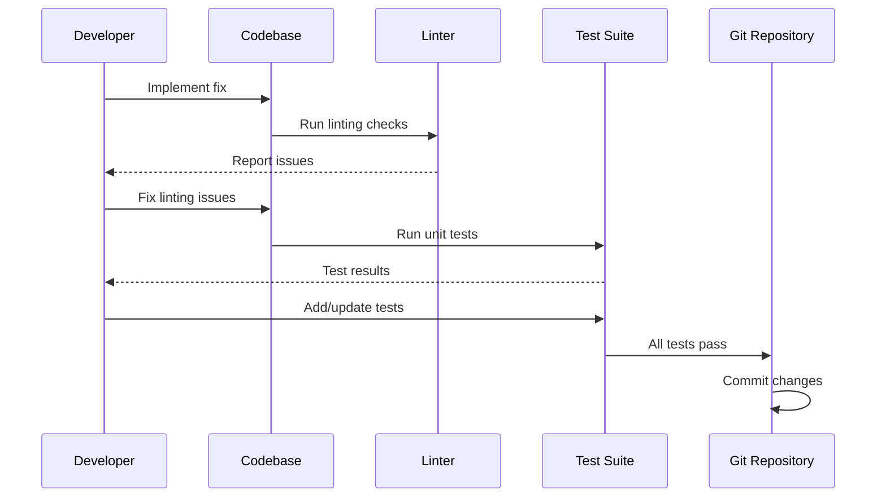
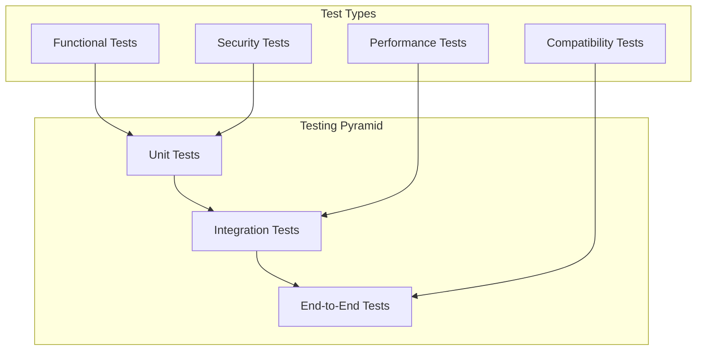
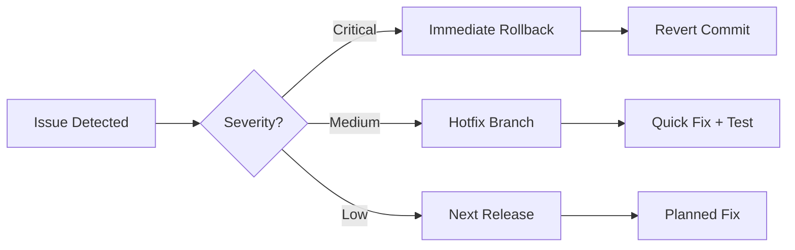

# PR Review TODO Fixes Design Document

## Overview

This document provides a comprehensive design for systematically addressing PR review comments, implementing fixes, ensuring code quality through linting and testing, and proper commit procedures for the GPT Researcher project.

## Architecture

### Review Process Architecture



### Comment Classification System

PR review comments are categorized into the following types:

1. **Critical Issues** - Security vulnerabilities, breaking changes
2. **Bug Fixes** - Logic errors, runtime issues
3. **Code Quality** - Style, performance, maintainability
4. **Documentation** - Comments, README updates
5. **Tests** - Missing or inadequate test coverage
6. **Architecture** - Design pattern improvements

## TODO List Generation Strategy

### Comment Analysis Framework



### Priority Matrix

| Category | Critical | High | Medium | Low |
|----------|----------|------|---------|-----|
| Security Issues | P1 | P1 | P2 | P3 |
| Bug Fixes | P1 | P2 | P3 | P4 |
| Performance | P2 | P2 | P3 | P4 |
| Code Quality | P3 | P3 | P3 | P4 |
| Documentation | P4 | P4 | P4 | P4 |

## Fix Implementation Process

### Development Workflow



### Code Quality Standards

#### Python Code Standards
- **Linting**: Use `pylint` and `black` for formatting
- **Type Hints**: Mandatory for all new functions
- **Documentation**: Docstrings required for public methods
- **Import Standards**: Use absolute imports as per project memory

#### JavaScript/TypeScript Standards
- **Linting**: Use ESLint with project configuration
- **Formatting**: Prettier for consistent code style
- **Type Safety**: TypeScript strict mode enabled

#### Testing Standards
- **Coverage Target**: Minimum 80% code coverage
- **Test Types**: Unit, integration, and E2E tests
- **Async Testing**: Use pytest-asyncio for async code
- **Mock Strategy**: Proper mocking for external dependencies

## Testing Strategy

### Test Categories



### Existing Test Framework Integration

Based on project analysis, the following test files exist:
- `test_persistence_refactor.py` - Database persistence tests
- `test_report_sources_formatting.py` - Report formatting tests
- `test_mcp_url_normalization.py` - MCP URL handling tests
- `test_researcher_logging.py` - Logging functionality tests

### Test Execution Commands

```bash
# Run all tests with coverage
uv run pytest tests/ --cov=gpt_researcher --cov-report=html -v

# Run specific test categories
uv run pytest tests/test_persistence_refactor.py -v
uv run pytest tests/test_report_sources_formatting.py -v
uv run pytest tests/test_mcp_url_normalization.py -v

# Run linting
pylint gpt_researcher/
black --check gpt_researcher/

# Frontend testing
cd frontend/nextjs && npm test
```

## Commit Strategy

### Commit Message Standards

Follow conventional commit format:

```
<type>[optional scope]: <description>

[optional body]

[optional footer(s)]
```

#### Commit Types
- `fix`: Bug fixes
- `feat`: New features  
- `docs`: Documentation changes
- `style`: Code style changes
- `refactor`: Code refactoring
- `test`: Adding or updating tests
- `chore`: Maintenance tasks

#### Examples
```
fix(scraper): resolve async embedding generation blocking issue

- Implement thread pool executor for non-blocking operations
- Add batch processing with configurable size
- Improve connection pooling efficiency

Closes #123
```

### Branch Management

```mermaid
gitgraph
    commit id: "main"
    branch pr-review-fixes
    checkout pr-review-fixes
    commit id: "fix: persistence layer"
    commit id: "test: add persistence tests"
    commit id: "docs: update API docs"
    checkout main
    merge pr-review-fixes
    commit id: "merge: pr fixes"
```

## Implementation Checklist

### Pre-Fix Phase
- [ ] Analyze all PR review comments
- [ ] Create prioritized TODO list
- [ ] Estimate effort for each item
- [ ] Create feature branch from main

### Fix Implementation Phase  
- [ ] Implement fixes in priority order
- [ ] Follow coding standards
- [ ] Add/update documentation
- [ ] Write comprehensive tests

### Quality Assurance Phase
- [ ] Run linting checks (pylint, black, ESLint)
- [ ] Execute unit tests with coverage
- [ ] Run integration tests
- [ ] Perform manual testing where needed

### Commit Phase
- [ ] Stage changes systematically
- [ ] Write descriptive commit messages
- [ ] Squash related commits if needed
- [ ] Push to feature branch

### PR Update Phase
- [ ] Update PR description with changes
- [ ] Link to resolved issues
- [ ] Request re-review from maintainers
- [ ] Address any new feedback

## Integration with Existing Fixes

### Previously Implemented Fixes

The project already has several implemented fixes documented in `FIXES_IMPLEMENTED.md`:

1. **Persistence Layer Refactoring** - Async database operations
2. **Report Sources Formatting** - Safe key access and formatting
3. **MCP Sentinel URL Normalization** - Consistent URL handling

### Building Upon Existing Work

New fixes should:
- Follow established patterns from previous fixes
- Use existing test frameworks and utilities
- Maintain backward compatibility
- Leverage existing optimization techniques

## Error Handling and Recovery

### Common Issues and Solutions

| Issue | Detection | Solution |
|-------|-----------|----------|
| Linting Failures | CI/CD Pipeline | Fix style issues, update config |
| Test Failures | Test Suite | Debug, fix logic, update tests |
| Merge Conflicts | Git Operations | Rebase, resolve conflicts |
| Performance Regression | Benchmarks | Profile, optimize, validate |

### Rollback Strategy



## Monitoring and Validation

### Success Metrics

- **Code Quality**: Linting score improvement
- **Test Coverage**: Maintain >80% coverage
- **Performance**: No regression in benchmarks
- **Documentation**: All public APIs documented

### Continuous Integration Integration

The process integrates with existing CI/CD:
- Automated linting on PR updates
- Test execution on multiple Python versions
- Coverage reporting
- Security scanning

### Post-Implementation Review

After completing PR review fixes:
1. Measure improvement in code quality metrics
2. Validate performance benchmarks
3. Update documentation and examples
4. Share learnings with team